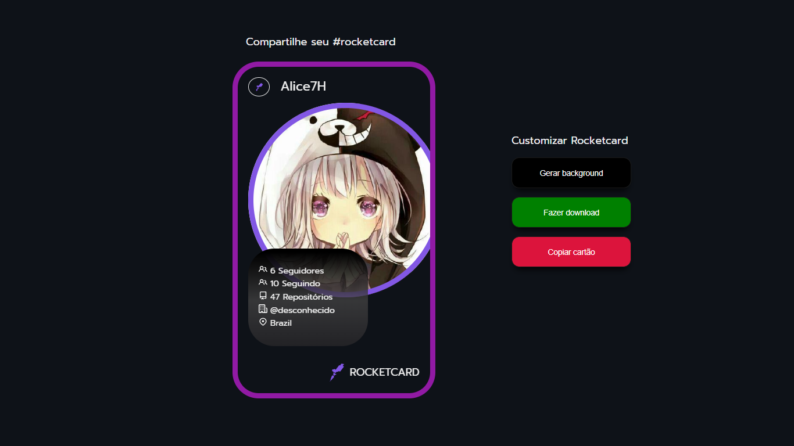

<h1 align="center">
  
</h1>

# ✅ **Requisitos**

---

Neste desafio foi proposto a construção de um card que altere as cores de fundo e tenha integração com a API do Github.

**Requisitos para o desafio:**

- Consumir API do Github;

- Ter um botão que altere a cor de fundo;

**_Se desafie também:_**

- Criando um botão para fazer o download do card;

- Copiar o card no `clipboard` ;

- Adicionando animação no card;

# 🎨 Style Guide

---

## **Cores:**

```css
:root {
  --bg: #000000;
  --bg-card: #0e1218;
  --text: #f1f1f1;
  --img-profile: #8257e5;
  --buttons: #fff;
  --border-button: #1a1a1a;
}
```

## **Tipo de fonte:**

font-family: Prompt

Font Weight: 100, 400 e 700

Você pode encontrar a fonte no [Google Fonts](https://fonts.google.com/)

## **Template:**

O template do projeto está [aqui](https://www.figma.com/file/xszb6WTlwCXWqE5jg4q2SO/DD-Rocketcard/duplicate).

Lembrando que para ver o layout você precisa ter uma conta no [figma](https://www.figma.com)
